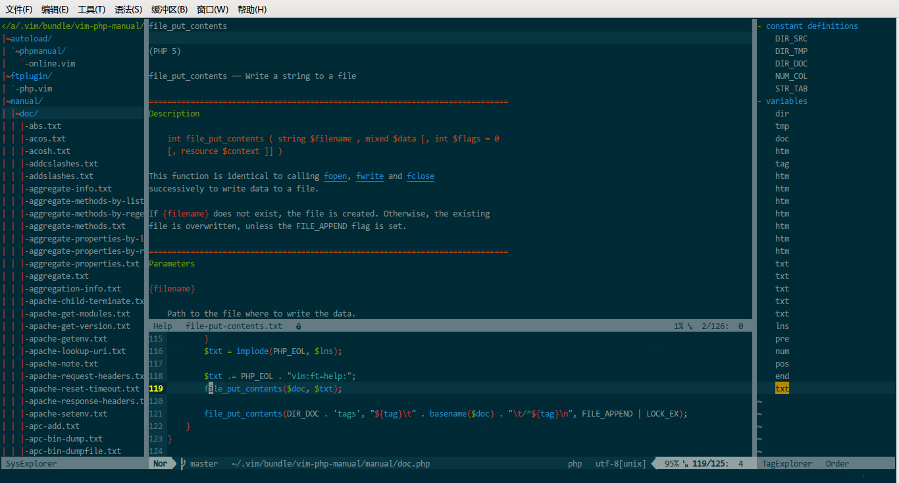

PHP Manual
==========

This is php manual plugin for vim with help keyword doc.

You can do these with this plugin:

_in normal mode,_

* press <kbd>SHIFT-k</kbd> to view the Explanation of the keyword under the cursor
* press <kbd>CTRL-h</kbd> to see the online manual of the keyword under the cursor

_in visual mode,_

* select content, and then press <kbd>SHIFT-k</kbd> to view the Explanation of the content
* select content, and then press <kbd>CTRL-h</kbd> to see the online manual of the content

Install
-------

a. Copy these files to runtimepath.(~/.vim,..) 

b. Use vundle:

        Plugin 'alvan/vim-php-manual'

c. Use other package manager.

Screenshots
-----------

GVim PHP help doc:

